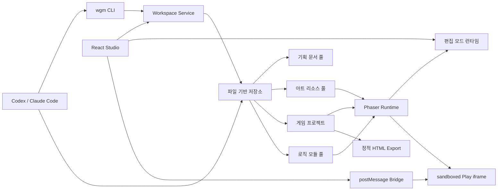

# WebGameMaker 구축 계획

- 작성일: 2026-07-12
- 기준 문서: [260712_시작점.md](./260712_시작점.md)
- 상태: 구현 전 기준 계획

## 1. 결론

WebGameMaker의 첫 버전은 범용 노코드 엔진이 아니라, **Claude Code/Codex와 사람이 함께 수정하기 쉬운 2D HTML 게임 제작 워크스페이스**로 구축한다.

핵심은 다음 네 가지다.

1. 기획 문서, 아트 리소스, 게임 로직을 파일과 스키마로 표준화한다.
2. 게임 코드는 복사하지 않고 설정 가능한 행동 모듈을 조합한다.
3. 에디터와 플레이어는 같은 런타임을 사용하되 별도 실행 컨텍스트로 격리한다.
4. 첫 게임을 먼저 완성한 뒤 실제로 재사용된 경계만 공용 모듈로 승격한다.

MVP는 `2D`, `싱글플레이`, `로컬 우선`, `Chromium 계열 데스크톱 브라우저`, `정적 HTML 내보내기`로 제한한다. 내장 AI 채팅, 3D, 멀티플레이, 비주얼 스크립팅, 클라우드 협업은 후속 범위다.

## 2. 시작점 해석과 현재 상태

기준 문서에서 요구하는 결과는 다음과 같다.

- 새 기획마다 게임을 처음부터 만들지 않는다.
- 플레이어 이동, 적 이동/AI 등 반복 로직을 축적하고 재사용한다.
- 기획 문서 풀과 SVG·PNG·JPG·WebP 아트 리소스 풀을 운영한다.
- 에디터에서 UI/UX와 주요 속성을 조정한다.
- 에디터와 플레이 뷰를 분리한다.
- Claude Code/Codex가 파일을 탐색·수정·검증하기 쉬워야 한다.

현재 프로젝트에는 기준 문서만 있고 패키지 설정, 소스, 테스트가 없다. 프로젝트 자체 `.git`은 없으며 상위 `/Users/woody` 저장소의 `jp_work` 브랜치 범위에 잘못 포함된 상태다. 따라서 첫 구현 단계는 기능 개발이 아니라 **WebGameMaker 독립 저장소와 최소 데이터 계약을 만드는 일**이다.

## 3. MVP 기본 결정

| 항목 | MVP 결정 | 재검토 조건 |
|---|---|---|
| 주 사용자 | 기획자·개발자·디자이너와 외부 AI 코딩 에이전트 | 비개발자 단독 제작 요구가 확인될 때 |
| 게임 범위 | 2D 싱글플레이 | 2D 재사용 구조가 두 게임에서 검증된 뒤 |
| 첫 장르 | 탑다운 액션 | 이동·추적·충돌 모듈 검증 후 |
| 렌더링 | Phaser 기반 Canvas/WebGL | 런타임 요구가 Phaser 경계를 벗어날 때 |
| 물리 | 단순 충돌은 Arcade Physics | 복잡한 관절·다각형 물리가 실제로 필요할 때 |
| 제작 방식 | 파일/스키마 기반 + 얇은 비주얼 에디터 | 노코드 요구가 코드 기반 흐름보다 커질 때 |
| AI 통합 | Codex/Claude Code가 CLI와 저장소를 조작 | 반복 작업이 안정화된 뒤 MCP 또는 내장 AI 검토 |
| 저장 방식 | 로컬 파일 + Git | 다중 사용자와 원격 동기화가 필요할 때 |
| 배포 | 독립 실행 가능한 정적 HTML 번들 | 서버 저장·계정·실시간 기능이 필요할 때 |
| 브라우저 | Studio는 Chromium 데스크톱, export 게임은 Chromium 필수 + Firefox/WebKit smoke | 모바일 실기기나 추가 브라우저가 배포 대상이 될 때 |

위 결정은 2026-07-12 사용자 확인으로 확정됐다. 별도 변경 요청이 없으면 Phase 0부터 그대로 진행한다.

## 4. 설계 원칙

### 4.1 저장소가 단일 기준이다

- 기획 의도는 Markdown에 기록한다.
- 편집 가능한 게임 데이터는 JSON에 기록한다.
- 실행 로직만 TypeScript로 작성한다.
- 목록과 검색용 카탈로그는 원본 메타데이터에서 생성하며 직접 수정하지 않는다.
- UI 내부 데이터베이스에만 존재하는 숨은 상태를 만들지 않는다.

### 4.2 스키마가 코드보다 먼저다

- 게임, 장면, 엔티티, UI, 에셋, 모듈마다 `schemaVersion`을 둔다.
- 런타임, 에디터, CLI, AI 에이전트가 같은 스키마를 사용한다.
- 스키마 변경에는 마이그레이션과 이전 버전 fixture 테스트가 필요하다.
- TypeScript 스키마에서 JSON Schema를 한 방향으로 생성한다. 역변환 실험 API에는 의존하지 않는다.

### 4.3 상속보다 조합을 우선한다

- 엔티티는 `Transform + Renderable + Behavior[]` 형태로 구성한다.
- 전체 ECS나 비주얼 노드 시스템은 MVP에서 만들지 않는다.
- 이동, 추적, 순찰, 체력, 피해, 스폰, 카메라 같은 기능은 작은 행동 모듈로 결합한다.

### 4.4 편집과 실행은 분리하되 렌더러는 공유한다

- 편집 캔버스는 같은 런타임을 정지된 편집 모드로 사용한다.
- 플레이 뷰는 sandboxed iframe 안에서 별도 런타임 인스턴스로 실행한다.
- 에디터 상태, 키보드 입력, 게임 전역 상태가 서로 오염되지 않게 한다.

### 4.5 실제 재사용 후 추상화한다

- 첫 게임의 기능은 우선 게임 내부에서 완성한다.
- 명백한 기본 기능을 제외하면 두 번째 사용처가 생긴 뒤 공용 모듈로 승격한다.
- 게임별 에셋 ID, 장면 이름, 전역 singleton을 포함한 코드는 승격하지 않는다.

## 5. 권장 기술 기반

| 영역 | 선택 | 이유 |
|---|---|---|
| 언어 | TypeScript strict mode | AI와 사람이 계약을 추적하기 쉽고 런타임/에디터/CLI 타입을 공유할 수 있음 |
| 워크스페이스 | pnpm workspace | 앱과 공용 패키지를 한 lockfile과 workspace dependency로 관리 |
| 에디터 | React + Vite | 패널·인스펙터·명령 상태 UI에 적합하고 빠른 개발/빌드 루프 제공 |
| 게임 런타임 | Phaser 4 | Scene, 입력, 카메라, 로더, 오디오, 물리 기반을 직접 다시 만들지 않음 |
| 스키마 | Zod → JSON Schema | 런타임 검증, TypeScript 추론, 에디터 폼, AI용 스키마를 한 원본에서 제공 |
| 로컬 저장 | 작은 Node 워크스페이스 서비스 | 브라우저 권한에 의존하지 않고 프로젝트 파일을 검증 후 원자적으로 저장 |
| 단위/통합 테스트 | Vitest | TypeScript 패키지와 Vite 구성에 맞춘 빠른 테스트 |
| 실제 UI 검증 | Playwright | 에디터→저장→플레이 흐름과 스크린샷 회귀 검증 |

추가 원칙:

- 2026-07-12 조사 기준 시작 후보는 Phaser 4.2.1, React 19.2.x, Vite 8.1, pnpm 11, Zod 4다. Phaser 4.2.1은 공식 배포판이지만 API/Concepts 문서의 버전 표기가 일부 뒤처져 있으므로 Phase 0 호환성 spike를 통과한 뒤 lockfile, `packageManager`, Node LTS 버전 파일로 고정한다.
- 초기 패키지 수가 작으므로 Turborepo는 넣지 않는다. 빌드 그래프와 CI 캐시가 실제 병목이 될 때 추가한다.
- Phaser를 감추기 위한 거대한 범용 엔진 추상화는 만들지 않는다. 공용 모듈 manifest에 호환 엔진을 명시하고, 런타임 패키지 경계만 유지한다.
- Arcade Physics는 단순한 탑다운·플랫포머 충돌에 사용하고, Matter Physics 혼용은 MVP에서 금지한다.

### 5.1 Phaser 4.2.1 호환성 spike

Phase 0에서 최소 앱 하나로 다음을 먼저 검증한다.

- Vite 8.1, React 19.2, TypeScript strict 환경에서 Phaser 4.2.1 compile/build
- Scene 생성과 제거, Arcade Physics 충돌, 키보드 입력, 카메라 동작
- PNG와 SVG 로드 및 기준 크기/scale 반영
- iframe 안에서 player 부팅과 `postMessage` 왕복
- 같은 컨테이너에서 Phaser 인스턴스를 세 번 destroy/recreate한 뒤 canvas, listener, timer 잔존 0
- `base: './'` production build를 임의 하위 경로의 정적 서버에서 실행

모두 통과하면 4.2.1을 고정한다. 막는 회귀가 있으면 원인을 ADR에 남기고 4.1.0을 먼저 비교한다. 4.x 전체가 막힐 때만 3.90 계열을 대안으로 검토한다. spike 코드는 테스트 fixture로 전환하거나 삭제하고 별도 진행 로그는 만들지 않는다.

## 6. 전체 구조



### 6.1 권장 디렉터리

```text
WebGameMaker/
├── apps/
│   ├── studio/                 # React 에디터
│   ├── player/                 # 독립 부팅되는 Phaser 플레이어와 정적 export 진입점
│   └── workspace-server/       # 파일 읽기/검증/원자적 저장/미리보기 서버
├── packages/
│   ├── schema/                 # Zod 원본, 생성 JSON Schema, 마이그레이션
│   ├── runtime/                # Phaser 부트스트랩, 장면/엔티티 조립
│   ├── module-sdk/             # 행동 모듈 계약과 테스트 도구
│   ├── core-modules/           # 검증된 공용 행동 모듈
│   ├── asset-tools/            # 가져오기, 검사, 해시, 썸네일, 파생 파일
│   └── project-cli/            # create/search/validate/dev/build/promote
├── library/
│   ├── designs/                # 표준 기획 문서 풀
│   └── assets/                 # 아트 원본, 메타데이터, 파생 파일
├── games/                      # 개별 게임 프로젝트
├── templates/                  # 검증된 시작 템플릿
├── examples/                   # 모듈별 최소 실행 예제
├── tests/
│   ├── contracts/
│   ├── e2e/
│   └── visual/
└── docs/
    ├── architecture/
    └── decisions/
```

## 7. 파일 계약

### 7.1 게임 프로젝트

각 게임은 다음 구조를 기본으로 한다.

```text
games/<game-id>/
├── design.md
├── game.project.json
├── modules.lock.json
├── scenes/
│   └── <scene-id>.scene.json
├── ui/
│   └── <screen-id>.ui.json
├── src/
│   └── features/               # 아직 공용화되지 않은 게임 전용 로직
├── assets/                     # 해당 게임 전용 에셋만 저장
└── tests/
```

`game.project.json` 최소 필드:

- `schemaVersion`, `id`, `name`, `description`
- 기준 해상도, 스케일 정책, 방향, 배경색
- 진입 장면과 장면 목록
- 공용 모듈 의존성 및 에셋 참조
- 입력 프리셋, 오디오 정책, 저장 데이터 버전
- 빌드 대상과 정적 export 옵션

장면 파일 최소 필드:

- 장면 ID와 타입
- 엔티티 배열
- 각 엔티티의 stable ID, transform, renderable, behavior 설정
- 장면 전역 system 설정
- UI 화면 참조

### 7.2 기획 문서 풀

`library/designs/<design-id>/design.md`는 다음 고정 섹션을 가진다.

1. 한 줄 목표와 대상 사용자
2. 핵심 플레이 루프
3. 입력과 조작
4. 장면과 진행 구조
5. 엔티티·규칙·승패 조건
6. UI/HUD와 피드백
7. 필요한 아트·오디오 목록
8. 재사용할 기존 모듈·에셋
9. 새로 구현할 기능과 공용화 후보
10. 실행 가능한 인수 조건

front matter에는 `id`, `genre`, `tags`, `status`, `targetViewport`, `references`만 둔다. 세부 실행 데이터는 중복 작성하지 않고 `game.project.json`을 기준으로 삼는다.

### 7.3 아트 리소스 풀

각 리소스는 원본과 `asset.json` sidecar를 한 폴더에 둔다.

필수 메타데이터:

- stable `assetId`, 표시 이름, 타입, MIME, 확장자
- 원본 파일명, SHA-256, 크기, 가로/세로, 투명도 여부
- 태그, 색감, 용도, 스타일 계열
- 출처, 제작자, 라이선스, 사용 제한
- 파생 WebP/썸네일 경로
- 사용 중인 게임과 대체 가능한 리소스

운영 규칙:

- 게임은 물리 경로가 아니라 `assetId`를 참조한다.
- 동일 해시 파일은 중복 등록하지 않는다.
- SVG는 외부 참조와 스크립트를 제거한 뒤 preview한다.
- Phaser가 SVG를 bitmap texture로 변환하므로 import 시 기준 크기와 scale 정책을 기록한다.
- PNG/JPG/WebP는 MIME과 실제 파일 signature를 함께 검사한다.
- 공용 아트 풀 전체를 Vite `public`에 넣지 않는다. build 시 현재 게임이 참조한 파일만 staging하고 해시된 export 경로를 생성한다.
- 대용량 증가 전까지 로컬 Git으로 관리하고, 규모가 커지면 바이너리만 Git LFS 또는 object storage로 이동한다.
- 검색용 `catalog.json`과 썸네일은 도구가 생성한다.

### 7.4 로직 모듈

공용 모듈 하나는 다음을 반드시 포함한다.

```text
packages/core-modules/<module-id>/
├── module.manifest.json
├── src/index.ts
├── schema.ts
├── README.md
├── fixtures/
├── tests/
└── example/
```

manifest 최소 필드:

- `id`, `version`, `category`, `description`, `tags`
- 호환 런타임/엔진과 최소 schema version
- 설정 schema ID
- 입력 이벤트, 출력 이벤트, 필요한 capability
- 다른 모듈 의존성
- 예제 게임과 마이그레이션 목록

행동 모듈 생명주기:

- `setup(context, config)`: 의존성 연결
- `start()`: 장면 시작 후 초기화
- `update(delta)`: 필요한 모듈만 frame update
- `handle(event)`: typed event 수신
- `destroy()`: listener와 자원 정리

모듈은 `input`, `clock`, `random`, `eventBus`, `assets`, `physics` 같은 capability를 context로 받는다. 브라우저 전역, 장면 이름, 특정 게임 에셋 ID를 직접 참조하지 않는다.

모듈 registry는 build-time allowlist다. 프로젝트 JSON이 임의 URL이나 임의 JavaScript를 동적으로 `eval`하거나 설치하게 하지 않는다.

## 8. 첫 공용 모듈 세트

첫 탑다운 게임을 기준으로 다음 순서로 만든다.

### P0

- `player-move-2d`: 키보드/가상 입력, 속도, 가속, 정규화
- `camera-follow`: 대상, easing, bounds, dead zone
- `health`: 최대/현재 체력, 피해/회복 이벤트
- `damage-contact`: 충돌/overlap 기반 피해와 cooldown
- `enemy-patrol`: waypoint, 대기, 반복 방식
- `enemy-chase`: 감지 거리, 추적/복귀, 속도
- `collision-layer`: 그룹과 충돌 관계 설정
- `scene-transition`: 조건 기반 장면 전환

### P1

- `spawn-wave`, `projectile`, `collectible`, `score`
- `animation-state`, `sound-cue`, `screen-feedback`
- `save-state`, `pause-menu`, `hud-binding`

AI 범용성을 위해 거대한 `PlayerController`나 `EnemyAI` 하나로 합치지 않는다. 이동, 감지, 상태, 공격, 표현을 별도 설정으로 조합한다.

## 9. 에디터와 플레이 뷰

### 9.1 에디터 레이아웃

- 좌측: 장면/엔티티 트리, 에셋/모듈 탭
- 중앙: 편집 캔버스와 Play 탭 또는 분할 보기
- 우측: 선택 대상 인스펙터
- 하단: 검증 오류, 런타임 로그, 이벤트 추적
- 상단: 프로젝트 선택, 저장 상태, undo/redo, viewport, play/reset, build

### 9.2 MVP 편집 기능

- 장면과 엔티티 생성·삭제·복제·순서 변경
- 위치, 회전, 크기, pivot, z-order 조정
- sprite/shape/text 교체와 주요 표현 속성 조정
- 행동 모듈 추가·제거 및 schema 기반 속성 편집
- 게임 HUD를 포함한 UI의 anchor, offset, 크기, 텍스트, 색상 조정
- 에셋 검색·미리보기·드래그 적용
- 명령 기반 undo/redo, dirty 표시, 명시적 저장
- 데스크톱/모바일 기준 viewport preview. MVP의 모바일 preview는 레이아웃 시뮬레이션이며 모바일 실기기 지원을 의미하지 않음
- 저장 전 전체 schema와 참조 무결성 검증

MVP에서는 픽셀 편집, 벡터 드로잉, 애니메이션 타임라인, 타일맵 제작기, 코드 없는 조건 그래프를 만들지 않는다.

### 9.3 플레이 뷰 격리

- iframe은 저장 파일 또는 에디터 draft snapshot을 읽어 새 런타임을 생성한다.
- 통신은 versioned `postMessage` protocol만 사용한다.
- 최소 메시지는 `loadProject`, `applyDraft`, `play`, `pause`, `reset`, `selectEntity`, `runtimeError`, `ready`다.
- 매 play/reset마다 장면, 이벤트 listener, 타이머, 입력 상태가 완전히 초기화돼야 한다.
- 런타임 예외와 schema 오류는 에디터 하단 패널에 연결한다.
- preview iframe에는 sandbox와 Content Security Policy를 적용한다.

## 10. Claude Code/Codex 중심 작업 흐름

### 10.1 계획된 CLI 표면

명령 이름은 Phase 0에서 확정하되 다음 동작을 제공한다.

```text
wgm game create <id> --template <template-id>
wgm catalog search --type design|asset|module --tag <tag>
wgm asset import <path> --tags <tags>
wgm module create <id>
wgm module promote <game-feature-path>
wgm validate [game-id]
wgm dev [game-id]
wgm test [scope]
wgm build <game-id>
```

CLI는 사람이 쓰는 도구이면서 AI 에이전트의 안정된 API다. 초기에는 별도 MCP 서버를 만들지 않는다.

### 10.2 새 게임 제작 순서

1. 표준 기획 문서를 작성한다.
2. AI가 기획의 `재사용 후보`와 `신규 구현`을 분리한다.
3. 카탈로그에서 기존 템플릿, 모듈, 에셋을 찾는다.
4. CLI로 게임 골격을 생성한다.
5. JSON 설정과 게임 전용 TypeScript만 수정한다.
6. `validate → unit/contract test → dev play` 순서로 확인한다.
7. 에디터에서 배치·UI 값을 조정하고 Play iframe에서 다시 검증한다.
8. 정적 build 후 실제 브라우저에서 시작, 입력, 승패, 재시작을 확인한다.
9. 새 기능 중 재사용 기준을 만족한 것만 공용 모듈로 승격한다.
10. 두 번째 샘플 게임에서 복사 없이 재사용됨을 확인한 뒤 Studio 기능을 확장한다.

### 10.3 공용 모듈 승격 기준

다음 조건을 모두 만족해야 한다.

- 두 게임에서 사용됐거나, 이동/체력처럼 명백한 기반 기능이다.
- 게임별 장면·에셋·전역 상태 의존성이 없다.
- 설정 schema, 이벤트 계약, dependency가 명시돼 있다.
- 최소 example과 unit/contract test가 있다.
- 기존 게임을 공용 모듈로 교체해도 동작과 플레이 감각이 유지된다.
- catalog 검색으로 발견 가능하다.

## 11. 단계별 실행 계획

| 단계 | 작업 | 완료 게이트 |
|---|---|---|
| Phase 0. 저장소·최소 계약 | 독립 Git과 기준선 커밋, `.serena/` ignore 결정, pnpm/TypeScript/Vite/Vitest/Playwright 설정, 최소 game/scene/entity Zod schema·fixture·validator, 공통 명령, Phaser 4.2.1 호환성 spike와 ADR | `git rev-parse --show-toplevel`이 정확히 WebGameMaker를 가리키고 기준선 커밋 존재, 최소 fixture 검증과 빈 앱의 lint/typecheck/test/build 통과, 호환성 spike 통과 후 버전 pin |
| Phase 1. 런타임 수직 절편 | 최소 schema를 입력으로 에셋 로딩, 한 장면, 플레이어 이동, 적 순찰/추적, 체력/충돌, HUD, 재시작이 있는 탑다운 샘플 구현 | Chromium에서 한 판의 시작→플레이→승패→재시작 완주, console error 0, 모듈 추출 전 재사용 비용 기준선 저장 |
| Phase 2. 스키마·모듈 SDK 강화 | asset/module/UI schema, schema migration 골격, module lifecycle/capability/event 계약, 첫 P0 모듈 추출 | 수직 절편이 공용 모듈과 JSON 설정으로 동일하게 실행되고 이전/현재 schema fixture와 계약 테스트 통과 |
| Phase 3. 문서·에셋 풀과 CLI | 기획 템플릿/validator/catalog, asset sidecar, import/thumbnail/hash/catalog, create/search/validate/dev/build CLI | 기획 문서의 front matter·10개 고정 섹션 검증, design 검색과 게임의 design ID 참조 성공, 네 이미지 형식 등록·검색·참조 성공, 깨진 참조와 schema 오류 차단 |
| Phase 4. 재사용 증명 | 첫 게임과 규칙이 다른 탑다운 두 번째 게임 제작, 실제 중복 제거, 모듈 promotion/migration 보완, 제작량 비교 | 두 게임이 `player-move-2d`, `camera-follow`, `health`, `enemy-patrol`/`enemy-chase`, `collision-layer`를 package ID로 참조하고, 게임 간 금지 import·20줄 이상 중복 로직이 없으며 신규 공통 로직 작성량·수동 설정 단계가 50% 이상 감소 |
| Phase 5. Studio MVP | 파일 서비스, 프로젝트 선택, 트리, 편집 캔버스, 인스펙터, 에셋/모듈 브라우저, undo/redo, Play iframe | 에디터 수정→draft preview→저장→재실행과 play/reset 3회 후 입력·listener·timer 잔존 0이 E2E 테스트로 통과 |
| Phase 6. Export와 안정화 | `base: './'` 정적 export, 참조 asset staging/hashing, CSP/sandbox, visual regression, 성능 예산, 복구/백업, 사용 문서 | 임의 하위 경로의 정적 서버에서 Chromium 전체 흐름과 Firefox/WebKit 시작·입력·재시작 smoke 통과, 아래 성능·visual·보안 예산 통과 |

Phase 1이 통과하기 전에 본격적인 에디터를 만들지 않는다. Phase 4가 통과하기 전에는 Studio의 본격 기능, 템플릿 종류, 모듈 수를 공격적으로 늘리지 않는다.

재사용 비용은 같은 script로 계산한다.

- `commonGameplayLoc`: `games/<id>/src/features` 안의 P0 동작 구현에서 빈 줄·주석·test·generated를 제외한 TypeScript line 수
- `manualSetupSteps`: 깨끗한 scaffold에서 수직 절편 인수 조건까지 필요한 CLI/에디터 action을 실행 가능한 recipe로 센 수
- Phase 1의 모듈 추출 전 값을 `tests/benchmarks/reuse-baseline.json`에 고정한다.
- Phase 4에서 같은 script와 인수 조건으로 두 번째 게임을 측정해 두 값이 각각 50% 이상 감소해야 한다.

## 12. 검증 전략

### 12.1 자동 검증

- schema: 정상/오류 fixture, 버전 마이그레이션, unknown field 정책
- runtime: 고정 seed와 고정 delta를 이용한 결정론적 행동 테스트
- canvas adapter: jsdom 대신 Vitest Browser Mode에서 실제 브라우저 통합 테스트
- module: 생명주기, listener 정리, dependency 누락, 이벤트 타입
- asset: 네 형식 가져오기, 중복 해시, 잘못된 MIME, SVG sanitization
- integration: 프로젝트 생성→모듈 연결→저장→재로딩→build
- E2E: 에디터 속성 변경→Play 반영→reset→상태 초기화
- visual: 고정 브라우저/OS 환경에서 핵심 장면 스크린샷 비교

### 12.2 수동 플레이 검증

- 입력을 놓거나 iframe을 재실행해도 키 상태가 남지 않는다.
- Play를 반복해도 listener, 타이머, 오디오가 중복되지 않는다.
- viewport 변경 시 게임과 HUD가 같은 규칙으로 정렬된다.
- 에셋 교체 후 충돌 영역과 anchor가 예상대로 유지된다.
- build 결과를 개발 서버가 아닌 정적 서버에서 직접 검증한다.

### 12.3 단계별 검증 명령과 예산

Phase 0에서 아래 root script 이름을 실제 `package.json`에 고정한다.

| 범위 | 계획 명령 | 통과 조건 |
|---|---|---|
| 공통 정적 검사 | `pnpm lint && pnpm typecheck` | error 0 |
| 단위/계약 | `pnpm test` | 실패 0, 핵심 schema/module 분기 coverage 80% 이상 |
| 최소 fixture | `pnpm wgm validate examples/minimal` | schema·참조 오류 0 |
| 수직 절편 | `pnpm e2e --grep @vertical-slice` | 시작→승패→재시작, console error 0 |
| 기획 문서 | `pnpm test:designs` | front matter·10개 섹션·catalog 검색·game design 참조 통과 |
| 에셋 | `pnpm test:assets` | 4종 import와 악성/오류 fixture 기대 결과 일치 |
| 재사용 | `pnpm test:reuse && pnpm measure:reuse` | 게임 간 직접 import 0, 동일/정규화된 20줄 이상 gameplay block 0, 기준선 대비 두 비용 지표 각각 50% 이상 감소 |
| Studio | `pnpm e2e --grep @studio` | 편집→preview→저장→재실행, play/reset 3회 후 입력·listener·timer 잔존 0 |
| 릴리스 | `pnpm verify:release` | production build, 3개 브라우저 smoke, visual·security·performance gate 전체 통과 |

Phase 6 정량 예산:

- 고정 macOS/Chromium 검증 환경과 고정 seed의 기준 장면에서 200개 활성 엔티티를 60초 실행한다.
- frame time p95는 20ms 이하, 50ms 초과 frame 비율은 1% 이하다.
- Playwright 핵심 화면의 `maxDiffPixelRatio`는 동적 영역을 mask한 뒤 0.005 이하다.
- CSP가 inline/eval 실행을 차단하고 iframe이 부모 DOM 접근·top navigation을 수행하지 못한다.
- `../` path traversal, 허용 경로 밖 파일 요청, allowlist 밖 module ID를 모두 거부한다.
- script, event handler, 외부 reference를 넣은 악성 SVG fixture가 실행되지 않고 sanitize 또는 reject된다.

초기 CI 환경에서 이 예산을 안정적으로 측정할 수 없으면 수치를 임의 완화하지 않는다. 기준 환경과 측정 오차를 ADR로 고정한 뒤 예산을 조정한다.

### 12.4 MVP 성공 지표

- 첫 샘플과 두 번째 샘플 모두 독립 정적 HTML로 실행된다.
- 두 번째 게임은 P0 공용 모듈 소스를 복사하지 않는다.
- 같은 수준의 수직 절편을 기준으로 두 번째 게임의 신규 공통 로직 작성량과 수동 설정 단계가 첫 게임보다 50% 이상 줄어든다.
- SVG, PNG, JPG, WebP 등록과 preview가 모두 성공한다.
- 모듈 설정은 자동 생성된 인스펙터에서 수정 가능하다.
- 에디터 변경이 Studio 재시작 없이 Play draft에 반영된다.
- 새 공용 모듈을 등록하면 CLI와 에디터 검색에 동시에 나타난다.
- 모든 project/scene/asset/module 파일은 동일한 validator를 통과한다.
- 기준 플레이 흐름에서 처리되지 않은 console error가 없다.

## 13. 주요 위험과 대응

| 위험 | 대응 |
|---|---|
| 에디터를 먼저 만들어 런타임 요구가 계속 변함 | 첫 완성 게임과 런타임 계약을 선행 |
| 너무 이른 범용화로 설정이 복잡해짐 | 명백한 기반 기능 외에는 두 번째 사용처 후 승격 |
| JSON, 타입, 인스펙터 정의가 서로 달라짐 | Zod 원본에서 JSON Schema와 폼 메타데이터 생성, CI drift 검사 |
| AI가 파일을 임의 구조로 추가함 | CLI scaffold, schema validation, 디렉터리 책임 문서, 제한된 edit surface 제공 |
| preview가 에디터 전역 상태를 오염함 | sandboxed iframe과 versioned message bridge 사용 |
| SVG 또는 향후 외부 모듈이 코드를 실행함 | SVG sanitize, CSP, path validation, MVP 모듈은 신뢰된 저장소 코드로 제한 |
| 대용량 바이너리가 Git을 비대하게 만듦 | 메타데이터와 바이너리 분리 가능 구조, 임계점 이후 LFS/object storage 전환 |
| Phaser 의존성이 모듈 전체로 번짐 | runtime/module SDK 경계 유지, manifest에 엔진 호환성 명시 |
| 저장 중 파일 손상 | 임시 파일에 검증 후 atomic rename, 최근 정상 snapshot 보관 |
| 기능 범위가 게임 엔진 전체로 확장됨 | MVP 제외 목록과 단계별 완료 게이트 유지 |

## 14. 첫 구현 배치

실제 착수 시 한 번에 다음 범위까지만 진행한다.

1. WebGameMaker 경로에 독립 Git 저장소를 만들고 `git rev-parse --show-toplevel`이 이 경로와 정확히 같은지 확인한다.
2. `.serena/` 같은 로컬 도구 상태를 ignore하고 두 Plan 문서를 기준선으로 커밋한다.
3. pnpm workspace와 공통 TypeScript/test/lint/build 명령을 만든다.
4. `schema`, `runtime`, `module-sdk`, `core-modules` 패키지만 먼저 만든다.
5. 게임/장면/엔티티 최소 schema와 fixture/validator를 정의한다.
6. Phaser 4.2.1 호환성 spike를 통과시키고 정확 버전을 고정한다.
7. Phaser 부트스트랩과 한 장면을 실행한다.
8. `player-move-2d`와 `enemy-patrol`을 게임 내부 기능으로 구현한다.
9. 실제 경계를 확인한 뒤 두 기능을 module SDK 형식으로 옮긴다.
10. CLI `validate`와 `dev`를 추가한다.
11. unit/contract test와 실제 브라우저 smoke test를 통과시킨다.

이 배치에서는 Studio, 에셋 카탈로그 전체, 두 번째 게임, 배포 자동화를 만들지 않는다.

## 15. 확정된 실행 조건

2026-07-12 사용자 확인 사항:

1. 첫 샘플 장르는 탑다운 액션이다.
2. 에디터의 UI/UX 조정 범위에 게임 HUD를 포함한다.
3. 1차 사용자는 기획자·개발자·디자이너로 한정한다.
4. 첫 배포 목표는 로컬 정적 export다.
5. 공개 GitHub 저장소 `zzamjak-cloud/WebGameMaker`를 원격 기준 저장소로 사용한다.

위 조건이 바뀔 때만 MVP 범위와 단계 게이트를 다시 조정한다.

## 16. 공식 기술 근거

- [Phaser 4 다운로드](https://phaser.io/download/phaser4): 조사 시점 안정 버전 확인
- [Phaser Scene 개념](https://docs.phaser.io/phaser/concepts/scenes): 장면 생명주기와 입력·카메라·로더 등 Scene 단위 시스템
- [Phaser Physics 개념](https://docs.phaser.io/phaser/concepts/physics): Arcade Physics와 Matter Physics의 용도 및 제약
- [React 버전](https://react.dev/versions)과 [외부 시스템 연결](https://react.dev/reference/react/useEffect): Studio와 Phaser 인스턴스의 생명주기 경계
- [Vite 8.1 발표](https://vite.dev/blog/announcing-vite8-1)와 [정적 에셋 처리](https://vite.dev/guide/assets.html): 개발/build 기반과 참조 에셋 export 제약
- [Vite 공식 가이드](https://vite.dev/guide/): React/TypeScript 템플릿, 개발 서버, HMR, 정적 production build
- [pnpm Workspace](https://pnpm.io/workspaces): workspace protocol 기반 로컬 패키지 연결
- [Zod JSON Schema](https://zod.dev/json-schema): Zod schema의 JSON Schema 출력과 표현 불가능 타입 제약
- [Vitest Browser Mode](https://vitest.dev/guide/browser/): 실제 브라우저 기반 canvas adapter 통합 테스트
- [Playwright Visual Comparisons](https://playwright.dev/docs/test-snapshots): 고정 환경에서의 screenshot regression 방식
